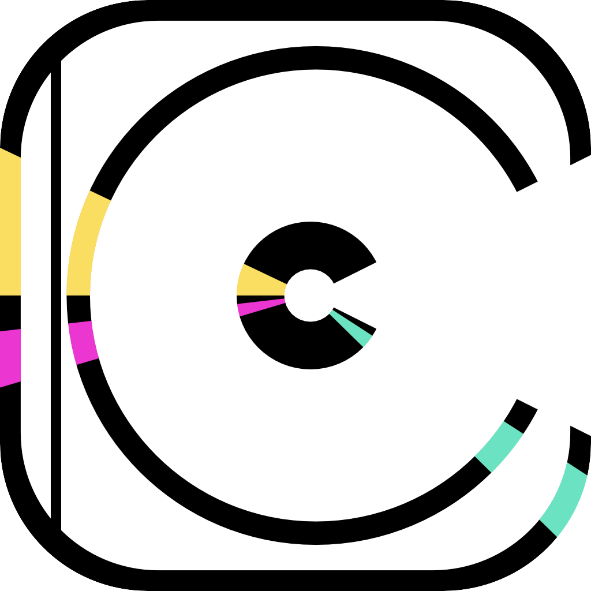

# CD Case Creator

**Version 2.0.2**

[Deutsch](#deutsch) · [English](#english)

A browser tool for designing CD case covers. Your artwork is fitted into the CD and case
areas of a template through colour masks, layered with stickers and text, and exported as a
PNG. Runs entirely offline — no build, no server, no uploads.

**Quick start:** double-click `cd-case-creator-v2.html`.

---
---

# Deutsch

Ein Browser-Werkzeug zum Gestalten von CD-Hüllen-Covern. Eigene Motive werden über
Farbmasken exakt in die CD- und Hüllenfläche einer Vorlage eingepasst, mit Sticker- und
Text-Ebenen überlagert und als PNG exportiert.

Läuft vollständig lokal: kein Build, kein Server, keine Uploads. Alle Bilder bleiben auf dem
eigenen Rechner.

**Sofort loslegen:** `cd-case-creator-v2.html` doppelklicken. Diese Datei ist
eigenständig — Schriften, Vorlagen und Gestaltung sind eingebettet, sie funktioniert ohne
Internet und ohne die übrigen Dateien.

## Neu in Version 2

- **Eine Datei für alle Geräte.** Hochkant erscheint das Werkzeugpanel unten und scrollt,
  im Querformat und am Monitor steht es als Spalte rechts — entschieden nach Bildschirmmaß,
  ohne Zutun.
- **Für Finger gebaut.** Alle Bedienelemente mindestens 44 Punkte, Ziehen, Drehen und
  Skalieren direkt im Bild, fingergerechte Bildlaufleisten für den gezoomten Ausschnitt.
- **Freie Sicht auf Knopfdruck.** Zoom, Erscheinungsbild und Sprache liegen als Kapseln über
  dem Bild und blenden aus, solange ein Finger darauf liegt.
- **Motive landen sichtbar.** Ein neues Bild oder ein neuer Text wird an seiner Fläche
  ausgemessen und passend eingesetzt, statt im Mittelloch der CD zu verschwinden.
- **Ehrliche Hinweise.** Eine Ebene außerhalb ihrer Fläche wird an der Ebene selbst markiert;
  Stanzen sagt, dass es die Hüllen-Tönung braucht, und schaltet sie auf Wunsch gleich ein.
- **Löschen mit Sicherung.** Der Papierkorb braucht zwei Tipps; dazwischen läuft das Rot des
  Knopfes sichtbar ab.
- **Export als PNG oder WebP.** WebP liefert dieselbe Qualität bei etwa einem Drittel der Größe;
  eine Zeile unter der Wahl erklärt beide.

## Was die App kann

- Motive über **Farbmasken** passgenau in CD- und Hüllenfläche einsetzen
- **Bis zu fünf Bild- und fünf Text-Ebenen**, frei stapelbar, jede einzeln transformierbar
- **Zehn eingebettete Schriften** mit Kontur, Deckkraft und freier Farbwahl
- **Hüllen-Tönung** — färbt den Kunststoff samt CD, aber nicht die außen aufgeklebten Sticker
- **Stanzen** — Text schneidet die Tönung heraus und gibt den klaren Blick darunter frei
- **Reflexion** mit einstellbarer Stärke in sechs Stufen und zufälliger Position
- Ziehen, Drehen und Skalieren direkt im Bild, mit Maus oder zwei Fingern
- **Zoom** bis 800 %, drei Prüfhintergründe
- **Hell- und Dunkelmodus**, **Deutsch und Englisch**
- **Export als PNG oder WebP** in voller Vorlagenauflösung

## Wie es funktioniert

Die Vorlage ist ein PNG, in dem die gestaltbaren Flächen als **reines Grün** (die CD) und
**reines Rot** (die Hüllenfläche) ausgemalt sind. Das Programm erkennt diese Farben, schneidet
sie aus und benutzt sie als Schablonen. Alles, was du einfügst, wird auf diese Flächen
beschnitten — nichts steht über den Rand hinaus.

Drei Vorlagen sind eingebaut, alle drei lassen sich gegen eigene Dateien tauschen.

## Schritt für Schritt

### 0 · Referenz-Layer — für Profis

Dieser Abschnitt ist zugeklappt, weil er im Normalfall nichts braucht: Die drei mitgelieferten
Vorlagen sind beim Start bereits geladen und richtig. Aufklappen lohnt nur, wer eigene Vorlagen
einsetzen will.

| Layer | Bedeutung |
| --- | --- |
| **Maske Grün** | Vorlage mit grüner CD-Fläche — bestimmt, wo das Motiv sitzt |
| **Maske Rot** | Zweite Zone auf der Hülle |
| **Reflexion / Glanz** | Lichtreflex, der über die rote Zone gelegt wird |

Jede Karte ist gleichzeitig ein Dateifeld: anklicken und eine eigene Datei wählen. Der
Papierkorb setzt den Layer zurück.

### 1 · Basis-Motiv einsetzen

Das Basis-Motiv ist das Hauptbild auf der CD. Auf die gestrichelte Fläche tippen, Bild
wählen — fertig. Es liegt immer ganz hinten und immer auf der CD.

### 2 · Sticker und Text stapeln

Sticker- und Text-Ebenen teilen sich eine Liste, die sich wie ein Ebenenstapel liest:
**oben in der Liste heißt oben im Bild.** Neue Ebenen kommen über den leeren Slot ganz oben
dazu.

Jede Ebene hat eine Werkzeugzeile:

- **Bild ersetzen** — anderes Motiv in dieselbe Ebene laden
- **Pfeile** — eine Position nach vorn oder hinten
- **Zonen-Schalter** — wechselt zwischen CD und Hülle. Der Knopf trägt die Farbe der Zone,
  in die er verschiebt: roter Knopf heißt „auf die Hülle", grüner „auf die CD"
- **Schloss** — Ebene gegen versehentliches Verschieben sichern
- **Spiegeln** — horizontal kippen
- **Papierkorb** — Ebene löschen. Der erste Tipp stellt scharf, der zweite löscht: Der Knopf
  färbt sich rot, und das Rot sinkt wie in einer Sanduhr nach unten ab. Läuft es aus, ohne dass
  du erneut tippst, passiert nichts

Unter den Ebenen stehen zwei Regler für die Reflexion: **Glanz-Deckkraft** in sechs Stufen
von 0 bis 50 %, daneben der Shuffle-Knopf, der den Lichtreflex an eine neue Position setzt —
mit weichem Übergang, nicht als Sprung.

### 3 · Text setzen

**Text-Layer hinzufügen** legt eine neue Textebene an. Zehn eingebettete Schriften stehen
bereit, jede im Auswahlraster in ihrer eigenen Schrift gesetzt.

- **Größe** bis 1800 px — bewusst weit über die Vorlage hinaus, für Layouts, bei denen die
  Schrift über den Rand läuft
- **Deckkraft** von 5 bis 100 %
- **Farbe** — Weiß, Schwarz, freie Farbe über Farbton/Sättigung/Helligkeit, oder **Stanzen**
- **Kontur** bis 120 px; die Konturfarbe ergibt sich automatisch aus der Füllung
- **Lage im Aufbau** — bei Text auf der CD: unter dem Glanz oder darüber

**Stanzen** gibt es nur für Text auf der Hülle und nur bei eingeschalteter Tönung. Die
Buchstaben schneiden die Tönung heraus und geben den ungetrübten Blick auf die CD und ihre
Sticker frei. Der Text selbst ist unsichtbar — er wirkt als Fenster.

### 4 · Ebene bearbeiten

Auf eine Ebene tippen, um sie auszuwählen (roter Rahmen). Dann:

- **Im Vorschaubild ziehen** verschiebt sie
- **Zwei Finger** drehen und skalieren gleichzeitig
- Die Regler für Skalierung, Drehung und Position X/Y machen dasselbe genauer
- **Layer zurücksetzen** stellt Ausgangsgröße, -drehung und -position wieder her

Gesperrte Ebenen reagieren auf nichts davon.

### 5 · Hüllen-Tönung

Färbt den Kunststoff der Hülle ein — und damit alles, was er einschließt: CD, Basis-Motiv,
die Sticker darauf und die Reflexion. Sticker, die außen auf der Hülle kleben, bleiben
unberührt; die transparenten Ränder ebenfalls.

**Abdunkeln** für satte, **Aufhellen** für milchige Tönungen. Farbton, Sättigung, Helligkeit
und Stärke sind frei einstellbar, das Farbfeld zeigt die Mischung live.

### 6 · Exportieren

Zuerst das Format wählen:

- **PNG** — öffnet sich überall, auch in älteren Programmen; größere Datei
- **WebP** — gleiche Qualität bei etwa einem Drittel der Größe; jeder aktuelle Browser und jedes
  Telefon lesen es, manche ältere Bildbearbeitung nicht

**Cover exportieren** speichert das Bild in voller Vorlagenauflösung. Auf Geräten mit
Teilen-Funktion öffnet sich das native Teilen-Menü, sonst startet ein direkter Download. Das
Teilen-Menü setzt eine gesicherte Verbindung voraus; über eine lokale Adresse fällt der Export
auf den Download zurück.

## Vorschau-Werkzeuge

- **Zoom** über −/+, den Prozentwert zum Einpassen, oder Strg/Cmd + Scrollrad; über 100 %
  lässt sich der Ausschnitt verschieben
- **Hintergrund** zwischen Schachbrett, Dunkel und Hell umschalten, um Transparenz und helle
  wie dunkle Motive zu beurteilen
- **Regler** werden am Griff angefasst, nicht auf der Linie angetippt — so verstellt sich beim
  Scrollen durch die Liste nichts versehentlich
- Eine **Quittung** blendet über dem Bild kurz auf, wenn etwas geschehen ist, und verschwindet
  von selbst. Im Ruhezustand ist sie nicht da

## Erscheinungsbild und Sprache

Zoom, **Hell/Dunkel** und **Deutsch/Englisch** liegen als Kapseln über dem Bild — links der
Zoom, rechts Erscheinungsbild und Sprache. Beides wirkt sofort, ohne Neuladen.

Solange ein Finger auf dem Bild oder der leeren Fläche daneben liegt, blenden die Kapseln aus
und geben die Sicht frei; beim Loslassen kommen sie zurück.

## Eigene Vorlagen

Eine Vorlage ist ein PNG in Zielauflösung (die mitgelieferten sind 1600 × 1600):

- Die CD-Fläche in reinem Grün ausmalen — erkannt wird, was deutlich grüner als rot und blau ist
- Die Hüllenfläche in reinem Rot
- Alles andere ist die sichtbare Hüllengrafik
- Transparente Bereiche bleiben transparent und werden von keinem Effekt erfasst

Beim Laden einer eigenen grünen Maske übernimmt das Programm deren Auflösung — der Export hat
dann genau diese Größe. Vorlagen weit jenseits von 1600 × 1600 sind für diesen Zweck
unverhältnismäßig und lassen die Oberfläche beim Laden kurz stocken.

### Wenn etwas nicht sichtbar ist

Landet eine Ebene außerhalb ihrer Fläche — etwa im Mittelloch der CD —, sagt die App es an der
Ebene selbst: Statt des Dateinamens steht dort **⚠ Außerhalb der Fläche**, so lange, bis der
Zustand behoben ist.

Abschnitt **06 Debugging** am Ende des Panels sammelt technische Meldungen mit Uhrzeit, samt
Knöpfen zum Kopieren und Leeren. Im Normalfall steht dort „Keine Fehler seit dem Laden."

## Gut zu wissen

Die Arbeit wird **nicht gespeichert**. Ein Neuladen der Seite verwirft die Komposition.

Der Seitenzoom des Browsers ist gesperrt, damit Bedienelemente nicht versehentlich aus dem
Bild wandern. Der Zoom der App ist davon unberührt.

## Technik

Reines HTML, CSS und JavaScript. Keine Abhängigkeiten, kein Build-Schritt, keine
Netzwerkanfragen zur Laufzeit. Das Compositing läuft auf 2D-Canvas mit Pixel-Zugriff, die
Schriften sind eingebettet.

```
cd-case-creator-v2.html   Eigenständige Fassung — alles eingebettet
CD Case Creator.dc.html               Quelldatei
support.js                            Laufzeit-Hilfsfunktionen
fonts.css                             Die zehn eingebetteten Schriften
assets/                               Die drei Standard-Vorlagen und die Bildmarke
_ds/modernist-…/                      Gestaltung: Farben, Typografie, Komponenten
```

Zum Weiterarbeiten die Quelldatei bearbeiten, zum Verteilen die eigenständige Fassung.

---
---

# English

A browser tool for designing CD case covers. Your artwork is fitted into the CD and case
areas of a template through colour masks, layered with stickers and text, and exported as a
PNG.

Runs entirely on your machine: no build, no server, no uploads. Your images never leave the
computer.

**Quick start:** double-click `cd-case-creator-v2.html`. That file is
self-contained — fonts, templates and styling are embedded, and it works without an internet
connection and without the other files.

## New in version 2

- **One file for every device.** In portrait the tool panel sits at the bottom and scrolls; in
  landscape and on a monitor it stands as a column on the right — decided by screen
  measurement, with nothing to set.
- **Built for fingers.** Every control at least 44 points, drag, rotate and scale straight on
  the artwork, finger-sized scrollbars for the zoomed view.
- **A clear view on demand.** Zoom, appearance and language float over the artwork and fade out
  for as long as a finger rests on it.
- **Artwork lands where you can see it.** A new image or text is measured against its area and
  placed to fit, instead of vanishing into the spindle hole.
- **Honest notices.** A layer outside its area is flagged on the layer itself; punch says it
  needs the case tint and switches it on for you.
- **Delete with a safety net.** The bin needs two taps, and between them the button's red drains
  away in plain sight.
- **Export as PNG or WebP.** WebP gives the same quality at roughly a third of the size; a line
  under the choice explains both.

## What it does

- Fits artwork into the CD and case areas through **colour masks**
- **Up to five image and five text layers**, freely stacked, each transformed on its own
- **Ten embedded fonts** with outline, opacity and free colour choice
- **Case tint** — colours the plastic and the CD behind it, but not stickers stuck on the outside
- **Punch** — text cuts the tint away and reveals what lies beneath
- **Reflection** with adjustable strength in six steps and a randomised position
- Drag, rotate and scale directly in the artwork, with the mouse or two fingers
- **Zoom** up to 800 %, three test backgrounds
- **Light and dark mode**, **German and English**
- **Export as PNG or WebP** at the template's full resolution

## How it works

A template is a PNG in which the editable areas are painted **pure green** (the CD) and
**pure red** (the case area). The app detects those colours, cuts them out and uses them as
stencils. Anything you place is clipped to those areas — nothing spills over the edge.

Three templates are built in, and all three can be swapped for your own.

## Step by step

### 0 · Reference layers — advanced

This section starts folded away, because normally it needs nothing: the three bundled templates
are already loaded and correct. Unfold it only to use your own templates or to adjust the
templates.

| Layer | Meaning |
| --- | --- |
| **Green mask** | Template with the green CD area — defines where the artwork sits |
| **Red mask** | The second zone, on the case |
| **Reflection / gloss** | The highlight laid over the red zone |

Each card doubles as a file field: click it and pick your own file. The bin resets the layer.

### 1 · Place the base motif

The base motif is the main image on the CD. Tap the dashed area, pick an image, done. It
always sits at the very back and always on the CD.

### 2 · Stack stickers and text

Sticker and text layers share one list that reads like a layer stack: **top of the list is
on top of the artwork.** New layers appear below the empty slot at the top.

Each layer has a toolbar:

- **Replace image** — load a different image into the same layer
- **Arrows** — one position forward or back
- **Zone switch** — moves between CD and case. The button carries the colour of the zone it
  moves *to*: a red button means "onto the case", a green one "onto the CD"
- **Lock** — protect the layer against accidental changes
- **Flip** — mirror horizontally
- **Bin** — delete the layer. The first tap arms it, the second deletes: the button turns red
  and the red drains downwards like an hourglass. Let it run out without tapping again and
  nothing happens

Below the layers sit two controls for the reflection: **gloss opacity** in six steps from 0 to
50 %, and next to it the shuffle button, which moves the highlight elsewhere — as a soft
crossfade, not a jump.

### 3 · Set type

**Add text layer** creates a new text layer. Ten embedded fonts are available, each shown in
the picker set in its own typeface.

- **Size** up to 1800 px — deliberately far beyond the template, for layouts where the type
  runs off the edge
- **Opacity** from 5 to 100 %
- **Colour** — white, black, a free colour via hue/saturation/lightness, or **punch**
- **Outline** up to 120 px; the outline colour follows the fill automatically
- **Position in the stack** — for text on the CD: under the gloss or on top of it

**Punch** is available only for text on the case, and only with the tint switched on. The
letters cut the tint away and give an unfiltered view of the CD and its stickers. The text
itself is invisible — it acts as a window.

### 4 · Edit a layer

Tap a layer to select it (red border). Then:

- **Drag in the preview** to move it
- **Two fingers** rotate and scale at once
- The scale, rotation and position X/Y sliders do the same, precisely
- **Reset layer** restores the original size, rotation and position

Locked layers respond to none of it.

### 5 · Case tint

Colours the plastic of the case — and with it everything the case encloses: the CD, the base
motif, the stickers on it and the reflection. Stickers stuck on the outside stay untouched,
as do the transparent margins.

**Darken** for saturated tints, **Lighten** for milky ones. Hue, saturation, lightness and
strength are all adjustable, and the swatch previews the mix live.

### 6 · Export

Pick the format first:

- **PNG** — opens everywhere, including older software; larger file
- **WebP** — same quality at roughly a third of the size; read by every current browser and
  phone, but not by some older image software

**Export cover** saves the image at the template's full resolution. On devices with a share
function the native share sheet opens; otherwise the download starts directly. The share sheet
requires a secure connection; over a local address the export falls back to a download.

## Preview tools

- **Zoom** via −/+, the percentage to fit, or Ctrl/Cmd + scroll wheel; above 100 % the view
  can be panned
- **Background** switches between checker, dark and light, to judge transparency and both
  light and dark artwork
- **Sliders** are grabbed by the handle rather than tapped on the track, so scrolling through
  the list never changes a value by accident
- A **receipt** appears briefly over the artwork when something has happened, then goes away on
  its own. At rest it is not there

## Appearance and language

Zoom, **light/dark** and **German/English** float over the artwork — zoom on the left,
appearance and language on the right. Both take effect immediately, without a reload.

For as long as a finger rests on the artwork or the empty area beside it, the capsules fade out
to clear the view; they return when you let go.

## Your own templates

A template is a PNG at your target resolution (the bundled ones are 1600 × 1600):

- Paint the CD area pure green — what counts as green is anything clearly greener than it is
  red and blue
- Paint the case area pure red
- Everything else is the visible case graphic
- Transparent areas stay transparent and are left alone by every effect

Loading your own green mask adopts its resolution — the export is then exactly that size.
Templates far beyond 1600 × 1600 are disproportionate for this purpose and will make the
interface stall briefly while loading.

### When something is not visible

If a layer lands outside its area — in the spindle hole, say — the app says so on the layer
itself: instead of the file name it reads **⚠ Outside the area**, and stays that way until the
situation is fixed.

Section **06 Debugging** at the end of the panel collects technical messages with timestamps,
with buttons to copy and clear. Normally it reads "No errors since load."

## Worth knowing

Your work is **not saved**. Reloading the page discards the composition.

The browser's page zoom is disabled so controls cannot be scrolled out of view by accident. The
app's own zoom is unaffected.

## Technical

Plain HTML, CSS and JavaScript. No dependencies, no build step, no network requests at
runtime. Compositing runs on 2D canvas with pixel access; the fonts are embedded.

```
cd-case-creator-v2.html   Self-contained build — everything embedded
CD Case Creator.dc.html               Source file
support.js                            Runtime helpers
fonts.css                             The ten embedded fonts
assets/                               The three default templates and the brand mark
_ds/modernist-…/                      Styling: colours, type, components
```

Edit the source file to develop further; ship the self-contained build.

---
---

## Lizenz · License

**CD-Hüllen-Cover-Generator License** — © 2026 Patrick Majewski. Alle Rechte vorbehalten.

Nutzung zu privaten, nicht-kommerziellen Zwecken ist gestattet. Weitergabe, Veränderung,
Einbindung in andere Projekte und kommerzielle Nutzung bedürfen der vorherigen schriftlichen
Zustimmung des Autors.

Use is permitted for personal, non-commercial purposes. Redistribution, modification,
incorporation into other projects and commercial use require prior written permission from
the author.

Vollständiger Text · full text: [`LICENSE`](LICENSE)

Die eingebetteten Schriften stehen unabhängig davon unter der SIL Open Font License bzw.
Apache 2.0. · The embedded fonts are independently licensed under the SIL Open Font License
or Apache 2.0.
